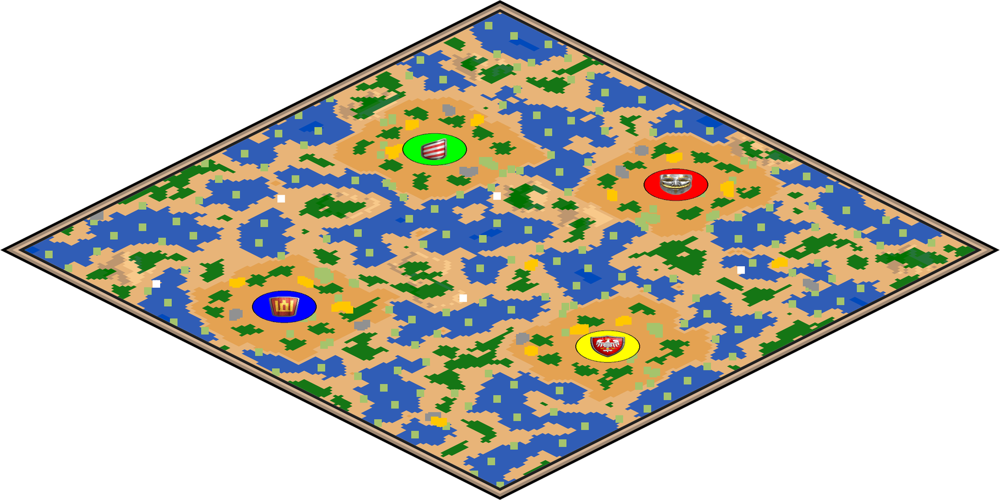
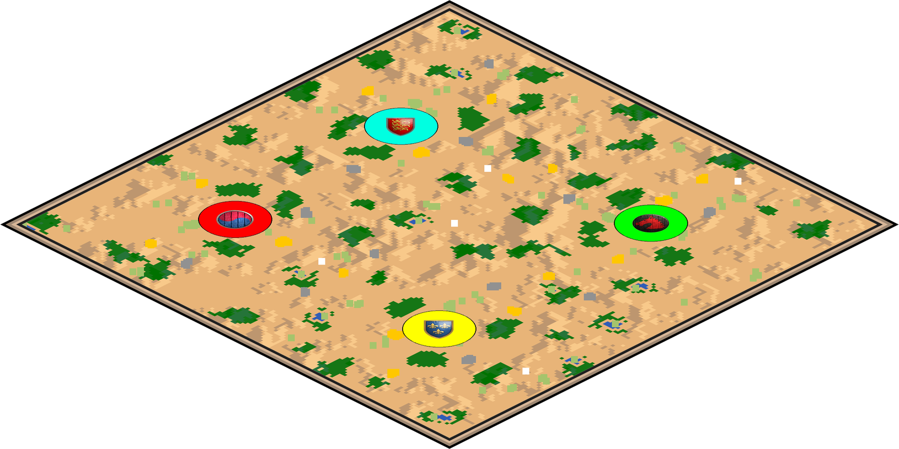

# McMinimap
 
McMinimap generates static Age of Empires 2 mini-maps using recorded game data, which I use to autopopulate my [YouTube Channel](https://www.youtube.com/@buttonbashofficial) intros!



# Features

 - Adjustable sizes for everything!
 - Adjustable 360 degree map orientation
 - "Square" or "Pixel" object modes
 - Easily show/hide individual resources
 - Optional Civ Emblem TC marker
 - Adjustable orthographic ratio (map tilt)
 - Elevation
 - Adjustable borders
 - Module mode - call the script as an addititonal module from elsewhere



# Usage

 - Download the entire structure. 
 - Update the settings section in McMinimap.py to point towards your recording file (currently there is a sample recording file set up).
 - Hit run and check the output, which is currently set to the same directory as the script.

Alternatively, the script can be run in "Module Mode" which allows it to be called  from elsewhere - e.g:

```python
from McMinimap import generate_minimap
minimap = generate_minimap(aoe2recording)
```

Just set ```module_mode``` to ```True``` in ```McMinimap.py```

# Thanks

Thankyou to **Marfullsen**'s excellent [AOE2 Minimap Generator](https://github.com/Marfullsen/AoE2-minimap-generator), on which this script was based on. In the end much got rewritten, but it certainly served as the inspiration and a great starting point.

Of course thanks to **happyleaves**'s [aoc-mgz](https://github.com/happyleavesaoc/aoc-mgz), which is key in parsing AOE2's recorded games.
